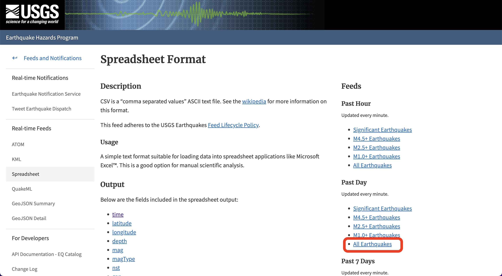
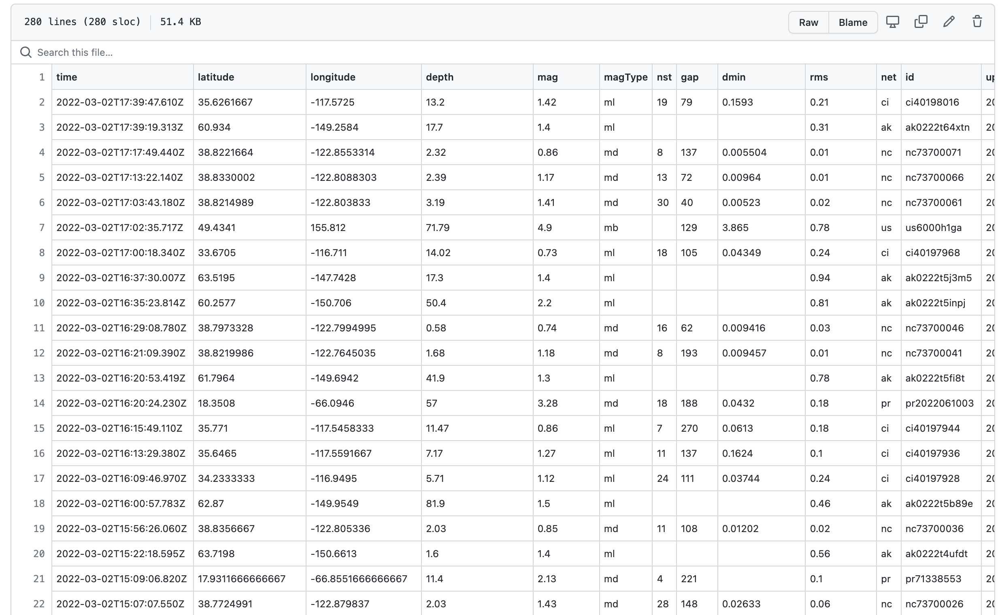
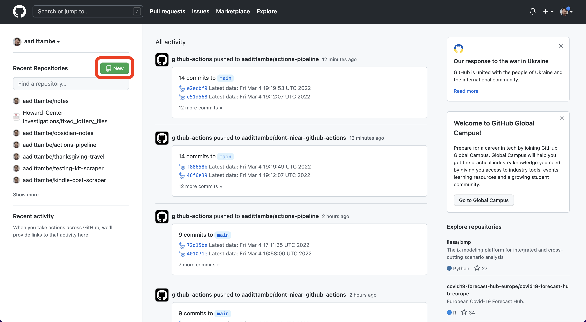
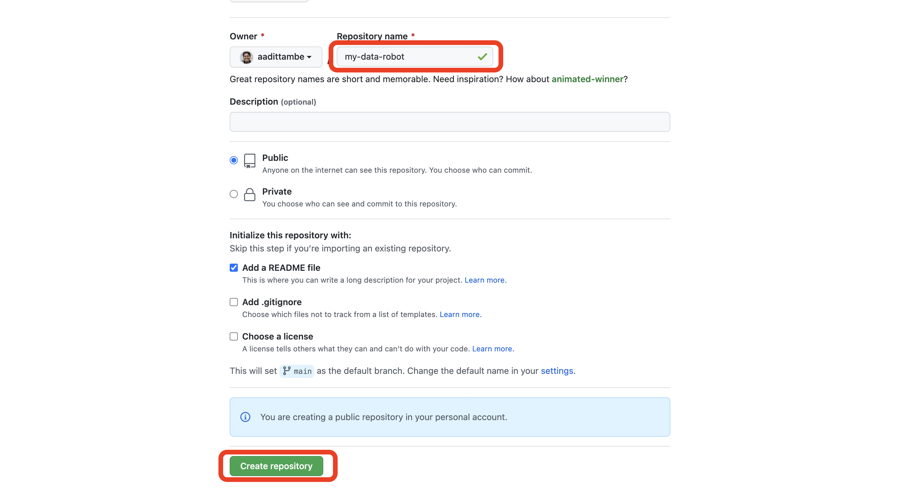
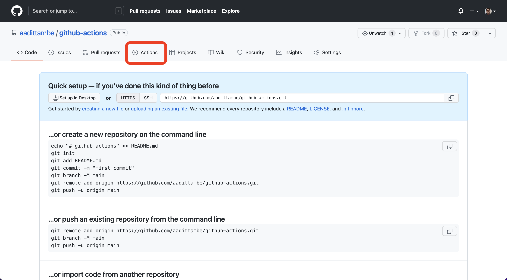
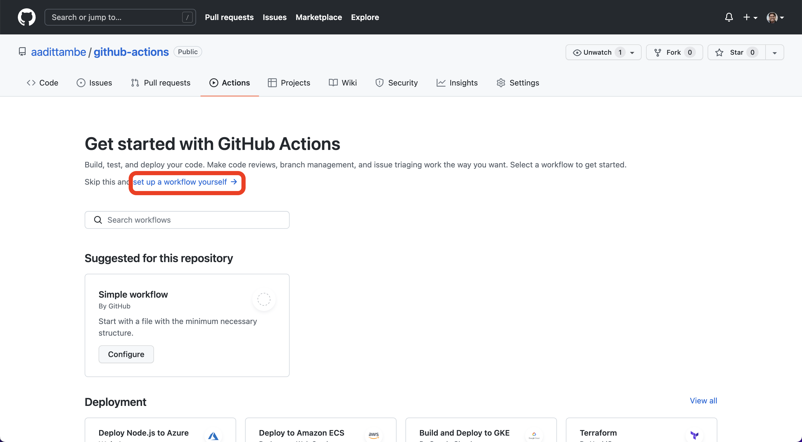
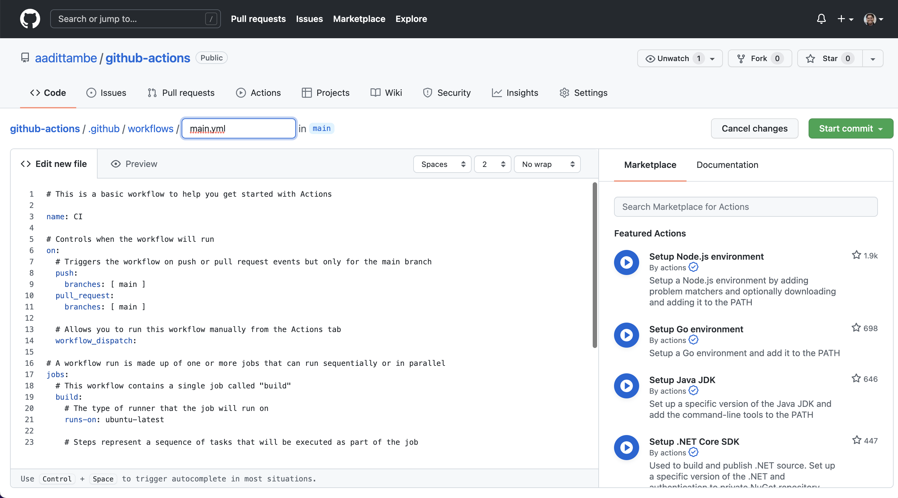
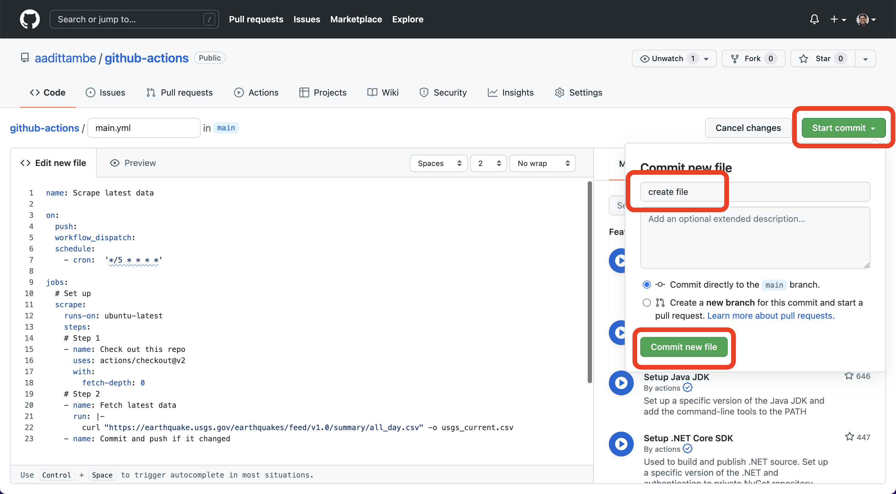
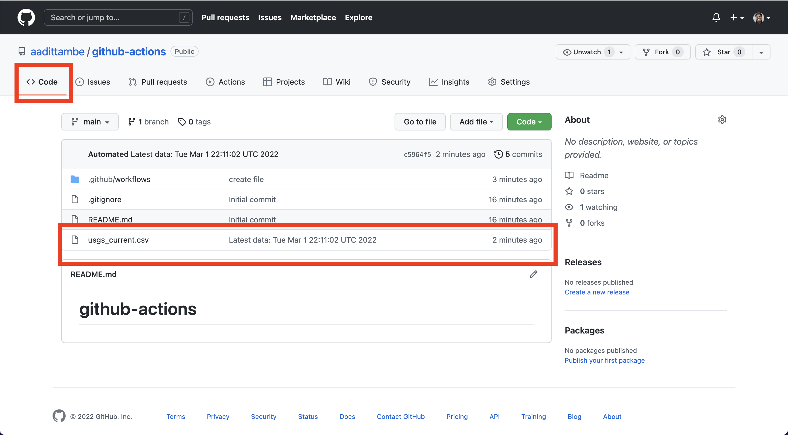

# Build a robot that collects data with GitHub Actions

This tutorial will teach you how to automate basic data collection, and potentially analyse it, with GitHub's free Actions framework.

- [About the authors](#about-the-authors)
- [What you will scrape](#what-you-will-scrape)
- [Prelude](#prelude)
- [Act 1: Hello, repository!](#act-1-hello-repository)
- [Act 2: Hello, Action!](#act-2-hello-action)
- [Epilogue: Hello, analysis!](#epilogue-hello-analysis)
## About the authors

This guide was prepared by [Daniel Lathrop](https://www.desmoinesregister.com/staff/4297418001/daniel-lathrop/), an investigative reporter at the Des Moines Register, and [Aadit Tambe](https://aadittambe.com/), a graduate student at the University of Maryland.

## What you will scrape
We are going to build a Git scraper using just a GitHub account and the web browser. We will scrape earthquake data provided by USGS. This records all earthquakes in the past day and is updated every minute. The file can be found at <a href="https://earthquake.usgs.gov/earthquakes/feed/v1.0/csv.php" target="_blank">this</a> page, and <a href="https://earthquake.usgs.gov/earthquakes/feed/v1.0/summary/all_day.csv" target="_blank">this</a> is the download link.



Our goal here is to use GitHub to scrape this file every 5 minutes, and overwrite it each time. 

At the end of this tutorial, your repository will have — and be updating — a CSV called `usgs_current.csv` that has the most current data scraped from the USGS website. 

## Prelude: Prerequisites

You need a free <a href="https://github.com/" target="_blank">GitHub account</a> to begin this tutorial.

## Act 1: Hello, repository!

This chapter will walk you through how to create a repository. A GitHub repository is a place to store your projects files and keep track of the revision history. Keeping track of your revision history means that you can go back to any point in time and see how your project appeared. 

In your profile on <a href="https://github.com/" target="_blank">GitHub</a>, navigate to the "repositories" tab and click the green "new" button.



Create a repository, call it `my-data-robot`.

Select public repository, meaning other people who visit your profile can see it.  



## Act 2: Hello, Action!

This chapter will walk you through how to create a GitHub Action that executes a script to fetch data on a schedule.

### 2.1. Create an Action file

In your repository, click on the “Actions” tab.



Once you’re in the “Actions” tab, click on “set up a workflow yourself.”



You will be directed to a YAML file, with a screen that looks like this: 



### 2.2. Write the workflow

In this file, we will write step-by-step instructions for GitHub to execute commands. GitHub Actions uses <a href="https://en.wikipedia.org/wiki/YAML" target="_blank">YAML</a> syntax to define the workflow. Delete everything in the file, and paste the text from here into the file. We will start with a different template instead, which is here.

```yaml
name: Scrape latest data

on:
  push:
  workflow_dispatch:
  schedule:
    - cron:  '*/5 * * * *' # If you enter a time here, note that it will be in UTC

jobs:
  scrape:
    runs-on: ubuntu-latest
    steps:
    # Step 1: Prepare the environment
    - name: Check out this repo
      uses: actions/checkout@v2
      with:
        fetch-depth: 0
    # Step 2: Get the latest data and store it as a CSV
    - name: Fetch latest data
      run: |-        
        curl "https://earthquake.usgs.gov/earthquakes/feed/v1.0/summary/all_day.csv" -o usgs_current.csv
    # Step 3: Commit and push
    - name: Commit and push
      run: |-
        git config user.name "Automated"
        git config user.email "actions@users.noreply.github.com"
        git add -A
        timestamp=$(date -u)
        git commit -m "Latest data: ${timestamp}" || exit 0
        git push
```

### 2.3. Understand the Action

GitHub calls this a “workflow.” It is a set of instructions written in a language called YAML that tells GitHub which commands to execute. 

The `name` keyword denotes an optional name given to the workflow. 

The `on` keyword specifies the trigger for this workflow — it’s currently set to run every time you “push” code to the repository, or when you click a manual button, denoted by “workflow_dispatch.” More importantly, it's set to run on a schedule. This schedule is defined by a cron expression, which is tell your computer to execute a command at a particular time.

---
**Note**

Cron, also known as a "cron job," is a process or task that runs periodically on a Unix system. If you are looking to find a cron expression of a schedule, we recommend using a tool such as <a href="https://crontab.guru/" target="_blank">Cron Guru</a> to make the conversion easier. If you're working on GitHub, you can change the expression in your YAML and hover over it, and GitHub will tell you if it's a valid expression.

---

The `jobs` keyword groups together all the commands that the Action will execute. We have called our “job” `scrape`.
The `runs-on` keyword configures the job to run on the latest version of an Ubuntu Linux runner. This means that the job will execute on a virtual machine hosted by GitHub, which is the latest version of Ubuntu. 

The `name` keyword here lets you give an optional name to the step.

The `uses` keyword specifies that this step will run v2 of the actions/checkout action. This is an action that checks out our repository onto the runner, allowing the virtual machine to save a copy of our repository and execute our code.

The `run` keyword tells the job to execute a command on the runner. In this `run`, the Action will download that earthquake file using the cURL tool, and save the data into a CSV called `usgs_current.csv`.

Here is the download URL: `https://earthquake.usgs.gov/earthquakes/feed/v1.0/summary/all_day.csv`

---
**NOTE**

cURL, which stands for client URL, is a command line tool that developers use to transfer data to and from a server. Read more about it <a href="https://developer.ibm.com/articles/what-is-curl-command/#" target="_blank">here</a>.

---

Then, we commit the results to our repository and push them, in the next step.

### 2.4. Save the file

Save this file. Click on the green box "Start commit", enter a commit message such as "created file," and click on "commit new file." You’re done! You’ve written a scraper that runs automatically every 5 minutes. 




### 2.5. Watch the Action run and log results in the repository

Wait for five minutes, and navigate back to the "code" tab of your repository. You will notice a newly created `usgs_current.csv` file.



